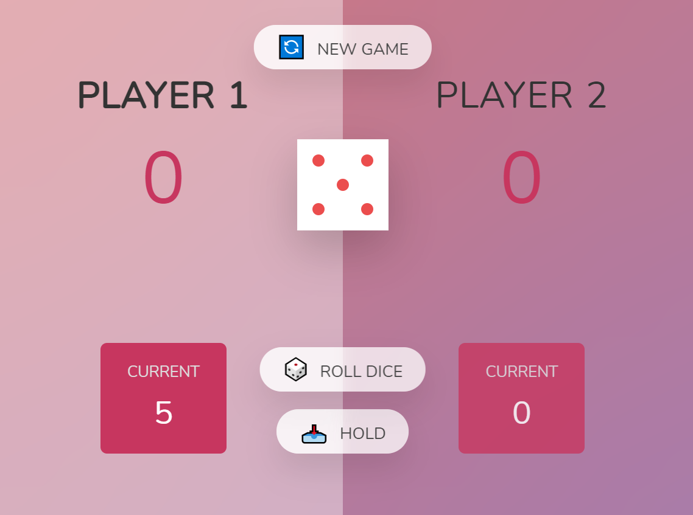
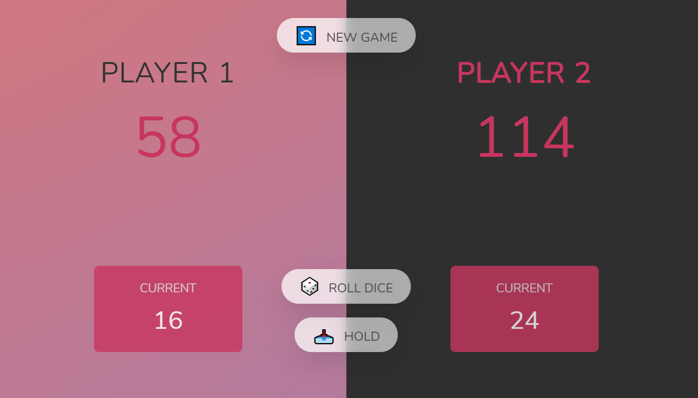

# PigGame

## This is a interactive dice game built on JS.
* [Javascript](#Javascript)
* [Dom](#Dom)

## Features
* Each time a player throws a dice, the dice number will be added to the current score.
* The current score is accumulated as global total score once the "hold" button is clikced.
* A player can throw a dice until the dice number is 1.
* At any point of the game, the game can be restarted with "new game" button.

## Sources
This app is inspired by [The Complete Javascript Course 2021](https://www.udemy.com)
